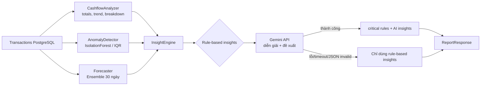
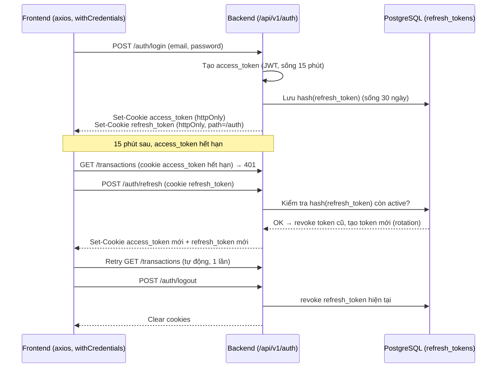

# 💰 Cashflow Pro — AI Quản Lý Thu Chi & Phân Tích Dòng Tiền

Ứng dụng web quản lý thu chi dành cho **hộ kinh doanh nhỏ và cá nhân**, tích hợp AI (Google Gemini) để phân tích dòng tiền, phát hiện giao dịch bất thường, dự báo dòng tiền 30 ngày tới và đưa ra khuyến nghị tài chính bằng tiếng Việt.

Toàn bộ tầng phân tích chạy **local bằng thống kê/ML (pandas, numpy, scikit-learn)** trước; Gemini chỉ đóng vai trò "diễn giải" số liệu đã tính sẵn thành ngôn ngữ tự nhiên. Nếu Gemini lỗi/timeout, hệ thống tự fallback về **Rule-Based Insight Engine** — báo cáo không bao giờ bị hỏng vì AI.

---

## ✨ Tính năng chính

| Nhóm | Chi tiết |
|---|---|
| **Xác thực** | Đăng ký / đăng nhập bằng JWT (access token ngắn hạn + refresh token revoke được), lưu trong cookie **httpOnly**, bcrypt hash password, rate-limit chống brute-force, route guard ở frontend qua `AuthProvider` |
| **Quản lý giao dịch** | Thêm/sửa/xóa giao dịch (Thu/Chi), lọc theo tháng & loại, phân trang |
| **Báo cáo dòng tiền** | Tổng thu, tổng chi, dòng tiền ròng, biểu đồ 7 ngày gần nhất (Recharts) |
| **Phân tích danh mục** | Cơ cấu chi phí/thu nhập theo danh mục, chỉ số tập trung HHI |
| **Phát hiện bất thường** | Isolation Forest (≥12 mẫu/danh mục) hoặc IQR + robust z-score (ít mẫu) |
| **Dự báo dòng tiền** | Ensemble: Exponential Smoothing + Damped Linear Trend + mùa vụ theo thứ trong tuần, có safety bounds |
| **AI Insight** | Gemini sinh tối đa 5 insight (`critical`/`warning`/`good`/`info`) kèm `title`, `message`, `action`; fallback rule-based khi AI lỗi |
| **Quỹ tiền mặt** | Ước tính số ngày quỹ tiền mặt còn trụ được dựa trên burn rate gần đây |
| **PWA** | Cài đặt như app độc lập trên điện thoại/laptop qua `manifest.json` |

---

## 🛠️ Tech Stack

### Backend
- **Python 3.10+**, FastAPI (async/await)
- SQLAlchemy 2.0 (Async Engine) + Alembic (migration)
- Pydantic v2 + Pydantic-Settings
- PostgreSQL 16
- JWT (python-jose) + bcrypt — access token ngắn hạn qua cookie httpOnly, refresh token opaque lưu hash trong DB
- **structlog** — logging có cấu trúc (JSON), bọc quanh stdlib `logging`, gắn `request_id` theo từng request
- **slowapi** — rate limiting cho endpoint xác thực
- Google Gemini API (`gemini-3.5-flash`) — retry Exponential Backoff (429/500/502/503/504), fallback Rule-Based Engine
- pandas, numpy, scikit-learn (IsolationForest, LinearRegression)

### Frontend
- Next.js 15 (App Router) + React 19 + TypeScript
- Tailwind CSS (design token qua `@theme` trong `globals.css`, theme "ledger/receipt")
- TanStack React Query v5 (data fetching/cache)
- React Hook Form + Zod (validate form)
- Recharts (biểu đồ)
- lucide-react (icon)

### DevOps
- Docker Compose: `db` (PostgreSQL 16, :5432) · `backend` (FastAPI, :8000) · `adminer` (:8088)

---

## 📁 Cấu trúc thư mục

```
backend/
├── app/
│   ├── api/
│   │   ├── dependencies.py          # get_current_user, DbSession/CurrentUser type aliases
│   │   └── v1/
│   │       ├── router.py
│   │       └── endpoints/{auth,reports,transactions}.py
│   ├── core/
│   │   ├── config.py                # Pydantic-Settings, đọc .env
│   │   ├── database.py              # Async engine + session factory
│   │   ├── security.py              # hash/verify password, JWT access token
│   │   ├── cookies.py                # set/clear cookie httpOnly access+refresh
│   │   ├── rate_limit.py             # slowapi limiter
│   │   ├── logging_config.py         # cấu hình structlog
│   │   └── middleware.py             # request logging + request_id
│   ├── models/{transaction,user,refresh_token}.py  # SQLAlchemy ORM
│   ├── schemas/{auth,report,transaction}.py  # Pydantic request/response
│   └── services/
│       ├── ai_analysis/
│       │   ├── cashflow_analyzer.py # Thống kê nền: totals, breakdown, trend, volatility, runway
│       │   ├── anomaly_detector.py  # Isolation Forest / IQR
│       │   ├── forecaster.py        # Ensemble forecast 30 ngày
│       │   ├── gemini_service.py    # Gọi Gemini, retry, parse JSON an toàn
│       │   ├── insight_engine.py    # Kết hợp rule-based + AI insight
│       │   └── labels.py            # Map category code -> nhãn tiếng Việt
│       ├── token_service.py          # issue/rotate/revoke refresh token
│       ├── health_service.py         # check DB + Gemini cho /health
│       ├── report_service.py
│       └── transaction_service.py
└── main.py

frontend/
├── app/
│   ├── (auth)/{login,register}/page.tsx
│   ├── (dashboard)/
│   │   ├── layout.tsx               # Sidebar desktop + bottom nav mobile
│   │   ├── page.tsx                 # Dashboard tổng quan
│   │   ├── reports/page.tsx         # Báo cáo + AI insight + forecast
│   │   ├── profile/page.tsx
│   │   └── transactions/{page,new/page,[id]/edit/page}.tsx
│   └── globals.css
├── components/
│   ├── ui/{confirm-dialog,error-banner,insight-card,skeleton}.tsx
│   └── transaction-form.tsx         # Form dùng chung cho create/edit
└── lib/
    ├── hooks/use-auth.tsx           # AuthProvider (Context)
    ├── providers/react-query-provider.tsx
    ├── schemas/transaction.ts       # Zod schema
    ├── types/{report,transaction}.ts
    ├── api-client.ts                # axios instance + interceptor
    ├── chart-theme.ts
    ├── constants.ts
    └── utils.ts
```

---

## 🧠 Luồng phân tích AI (Insight Engine)



**Nguyên tắc an toàn dữ liệu cho Gemini** (đã cấu hình trong system prompt):
- Không tự bịa số liệu, không tạo % / số tiền / ngưỡng mới ngoài INPUT.
- Phân biệt rõ doanh thu / chi phí / dòng tiền ròng / dự báo — không nhầm lẫn.
- Luôn nêu rõ độ tin cậy hạn chế khi dữ liệu ít.
- Output bắt buộc là JSON thuần, được `_extract_json()` parse an toàn (tự strip ```` ```json ```` nếu có), reject nếu sai định dạng.

---

## 🔐 Kiến trúc xác thực



**Điểm chính:**
- **Access token** (JWT, có claim `type: access`) sống ngắn — mặc định **15 phút** (`ACCESS_TOKEN_EXPIRE_MINUTES`), gửi qua cookie `httpOnly + Secure + SameSite`. JS không đọc được, không có gì để XSS đánh cắp qua `document.cookie`.
- **Refresh token** là chuỗi ngẫu nhiên (opaque, 64 byte, `secrets.token_urlsafe`), **không phải JWT** — chỉ hash (sha256) được lưu trong bảng `refresh_tokens`, không bao giờ lưu raw token, giống nguyên tắc không lưu plaintext password.
- **Rotation**: mỗi lần gọi `/auth/refresh`, token cũ bị revoke ngay và cấp token mới thay thế. Nếu một refresh token bị đánh cắp và kẻ tấn công dùng lại sau khi chủ tài khoản đã tự refresh, request đó sẽ bị từ chối vì token đã revoke — dấu hiệu để phát hiện replay.
- **Revoke được**: `/auth/logout` xóa refresh token khỏi DB ngay lập tức; `token_service.revoke_all_for_user()` có sẵn để đăng xuất user khỏi mọi thiết bị (gọi khi đổi mật khẩu / nghi ngờ bị xâm nhập — cần wire vào endpoint đổi mật khẩu nếu bạn thêm tính năng đó).
- **`get_current_user`** đọc token ưu tiên từ cookie; fallback sang header `Authorization: Bearer` để Swagger UI (`/docs`) và API client khác vẫn dùng được.
- **Rate limit**: `/auth/login` và `/auth/register` giới hạn **5 lần/phút theo IP** (`slowapi`), cấu hình qua `RATE_LIMIT_LOGIN` / `RATE_LIMIT_REGISTER`. Nếu backend chạy sau reverse proxy, phải cấu hình proxy forward đúng `X-Forwarded-For`, nếu không mọi client sẽ bị tính chung một IP.

> ⚠️ **Triển khai production**: nếu frontend và backend khác domain hoàn toàn (cross-site, vd. Vercel + Render khác domain), trình duyệt chỉ gửi cookie cross-site khi `SameSite=None; Secure=true`, và một số trình duyệt (Safari, Chrome tương lai) đang siết third-party cookie — khuyến nghị đặt backend dưới cùng domain qua subdomain (`api.yourapp.com` + `yourapp.com`) hoặc dùng rewrite/proxy của Next.js để cookie luôn same-site.

---

## 📊 Logging & Health Check

- **Structured logging (structlog)**: cấu hình ở `app/core/logging_config.py`, bọc quanh `logging` chuẩn của Python (`structlog.stdlib.ProcessorFormatter`), output tự động thành JSON có cấu trúc khi `DEBUG=false`, hoặc console dễ đọc khi `DEBUG=true`.
- **Request logging middleware** (`app/core/middleware.py`): mỗi request được gắn một `request_id` (UUID) duy nhất vào context — mọi log phát sinh trong lúc xử lý request đó (kể cả từ các service AI) đều tự động kèm `request_id`, giúp lần vết một request cụ thể trong hệ thống log tập trung (ELK/Datadog/CloudWatch). Log cuối mỗi request gồm `method`, `path`, `status_code`, `duration_ms`; response trả kèm header `X-Request-ID`.
- **`GET /health`** — kiểm tra thật thay vì trả tĩnh:
  - `database`: chạy `SELECT 1` qua session riêng, đo latency. **Bắt buộc** — nếu down, overall `"status": "down"`, HTTP **503**.
  - `gemini_ai`: gọi endpoint metadata model (nhẹ, không tốn quota sinh nội dung), đo latency. **Không bắt buộc** — vì có Rule-Based fallback, nếu Gemini down thì overall chỉ hạ xuống `"degraded"`, vẫn HTTP 200.

  ```json
  {
    "status": "ok",
    "service": "Cashflow Pro",
    "version": "0.1.0",
    "checks": {
      "database": { "status": "ok", "latency_ms": 4.2 },
      "gemini_ai": { "status": "ok", "latency_ms": 180.5 }
    }
  }
  ```

---

## ⚙️ Cài đặt & Chạy thử

### 1. Biến môi trường (`backend/.env`)

```env
DATABASE_URL=postgresql://postgres:postgres@db:5432/cashflow_pro
SECRET_KEY=change-me-to-a-random-secret
ALGORITHM=HS256

# Auth — access token ngắn hạn qua cookie httpOnly, refresh token dài hạn
# lưu hash trong DB (revoke được, rotate mỗi lần refresh).
ACCESS_TOKEN_EXPIRE_MINUTES=15
REFRESH_TOKEN_EXPIRE_DAYS=30

# Cookie — bật COOKIE_SECURE=true khi chạy https (bắt buộc cho production).
# Nếu frontend/backend khác domain: COOKIE_SAMESITE=none (đi kèm secure=true).
COOKIE_SECURE=false
COOKIE_SAMESITE=lax
COOKIE_DOMAIN=

# Rate limit chống brute-force cho /auth/login, /auth/register
RATE_LIMIT_LOGIN=5/minute
RATE_LIMIT_REGISTER=5/minute

GEMINI_API_KEY=your-gemini-api-key
GEMINI_MODEL=gemini-3.5-flash
MAX_UPLOAD_SIZE_MB=10
DEBUG=false
```

### 2. Docker Compose

```yaml
services:
  db:
    image: postgres:16
    environment:
      POSTGRES_DB: cashflow_pro
      POSTGRES_USER: postgres
      POSTGRES_PASSWORD: postgres
    ports: ["5432:5432"]
    volumes: ["pgdata:/var/lib/postgresql/data"]

  backend:
    build: ./backend
    env_file: ./backend/.env
    ports: ["8000:8000"]
    depends_on: [db]

  adminer:
    image: adminer
    ports: ["8088:8080"]
    depends_on: [db]

volumes:
  pgdata:
```

```bash
docker-compose up --build
# Backend docs: http://localhost:8000/docs
# Adminer:      http://localhost:8088
```

### 3. Frontend

```bash
cd frontend
npm install
# .env.local
echo "NEXT_PUBLIC_API_URL=http://localhost:8000/api/v1" > .env.local
npm run dev
# http://localhost:3000
```

### 4. Migration (Alembic — cần khởi tạo)

```bash
cd backend
alembic init alembic
alembic revision --autogenerate -m "init"
alembic upgrade head
```

---

## 📡 API chính (`/api/v1`)

| Method | Endpoint | Mô tả | Auth |
|---|---|---|---|
| POST | `/auth/register` | Đăng ký, set cookie access/refresh token (5 lần/phút/IP) | ❌ |
| POST | `/auth/login` | Đăng nhập, set cookie access/refresh token (5 lần/phút/IP) | ❌ |
| POST | `/auth/refresh` | Xoay refresh token, cấp access token mới | Cookie refresh_token |
| POST | `/auth/logout` | Revoke refresh token trong DB, xóa cookie | Cookie refresh_token |
| GET | `/auth/me` | Lấy thông tin user hiện tại | ✅ |
| PATCH | `/auth/me` | Cập nhật hồ sơ | ✅ |
| POST | `/transactions/` | Tạo giao dịch | ✅ |
| GET | `/transactions/` | Danh sách giao dịch (filter type/category/date/page) | ✅ |
| GET | `/transactions/{id}` | Chi tiết giao dịch | ✅ |
| PATCH | `/transactions/{id}` | Cập nhật giao dịch | ✅ |
| DELETE | `/transactions/{id}` | Xóa giao dịch | ✅ |
| GET | `/reports/summary` | Tổng hợp thu/chi tháng (không chạy AI, nhẹ/nhanh) | ✅ |
| GET | `/reports/monthly` | Báo cáo đầy đủ + AI insight + forecast + anomaly | ✅ |

Xác thực dùng cookie `httpOnly` (`access_token`/`refresh_token`) do backend set — trình duyệt tự đính kèm, frontend không cần set header thủ công. Header `Authorization: Bearer <token>` vẫn được hỗ trợ song song (fallback) để dùng qua Swagger UI (`/docs`) hoặc API client khác. Access token hết hạn (401) → frontend tự gọi `/auth/refresh` một lần rồi retry; nếu refresh cũng thất bại mới logout (trừ `login`/`register`/`refresh` để hiển thị đúng lỗi tại form).

---

## 🗃️ Schema dữ liệu chính

**`users`**: `id (UUID)`, `email (unique)`, `hashed_password`, `full_name`, `business_name`, `is_active`, timestamps.

**`transactions`**: `id (UUID)`, `user_id (FK, cascade delete)`, `type (income|expense)`, `amount (Numeric(15,0))`, `category (enum)`, `description`, `merchant_name`, `transaction_date`, timestamps. Index trên `user_id`, `type`, `category`, `transaction_date`.

**Danh mục (`TransactionCategory`)**
- Thu: `SALES`, `SERVICE`, `OTHER_INCOME`
- Chi: `FOOD`, `SUPPLIES`, `SALARY`, `UTILITIES`, `RENT`, `TRANSPORT`, `MARKETING`, `OTHER`

Validation category↔type được thực hiện ở tầng Pydantic (`_validate_category_matches_type`) và dùng lại ở cả `create` lẫn `update`.

---

## 📄 License

Dự án phân phối theo giấy phép MIT. Xem `LICENSE`.